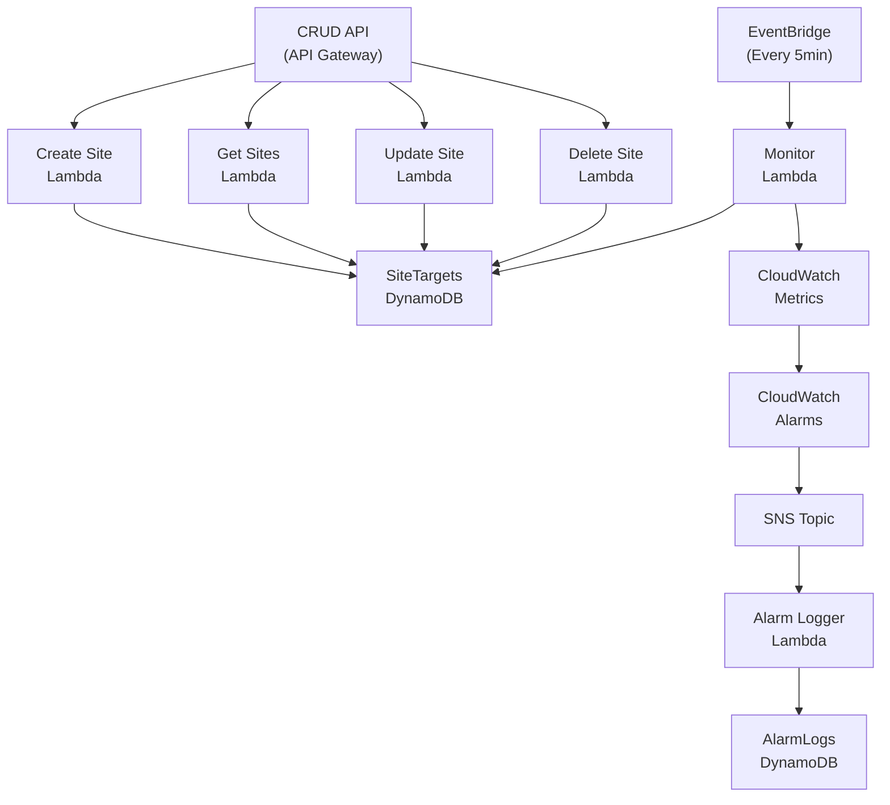

# Website Availability Monitor with Dynamic CRUD API

This project consists of **two integrated AWS solutions** deployed via **AWS CDK (Python)** with **CI/CD pipeline**:

## 🚀 Project 1: Static Website Monitoring System
* **Lambda function** for website health checks (latency, HTTP status, availability)
* **EventBridge rule** scheduling checks every 5 minutes
* **Custom CloudWatch metrics** and **alarms** with **SNS notifications**
* **DynamoDB table** for alarm event logging
* **CloudWatch Dashboard** for visual monitoring

## 🛠️ Project 2: Dynamic CRUD API for Site Management
* **REST API** (API Gateway + Lambda) for managing monitored websites
* **DynamoDB table** for persistent site storage
* **Full CRUD operations**: Create, Read, Update, Delete sites
* **Dynamic CloudWatch integration** - alarms auto-created/deleted with sites
* **Integrated monitoring** - monitor Lambda reads sites from DynamoDB dynamically


---

## 📝 Architecture Overview



## 🛠️ Prerequisites

* **AWS CLI** configured with appropriate permissions
* **Python 3.10+** installed
* **Node.js** for AWS CDK
* **AWS CDK** installed globally:

```bash
npm install -g aws-cdk
```

## 🚀 Quick Start

### 1. Clone & Setup
```bash
# Clone the repository
git clone <repository-url>
cd week2prac

# Set up virtual environment
python3 -m venv .venv
source .venv/bin/activate  # On Windows: .venv\Scripts\activate

# Install dependencies
pip install -r requirements.txt
```

### 2. Configure & Deploy
```bash
# Bootstrap CDK (first time only)
cdk bootstrap

# Deploy the full pipeline
cdk deploy
```

**Note:** The deployment creates a **multi-stage CI/CD pipeline** with **Beta**, **Gamma**, and **Production** environments.

---

## 📊 How It Works

### Project 1: Static Monitoring (Original)

**Monitor Lambda** runs every 5 minutes via **EventBridge**:

1. **Reads sites** from `sites.json` (static configuration)
2. **HTTP health checks** - measures latency, status codes, availability
3. **Publishes CloudWatch metrics**:
   - `WebMonitor/Latency`
   - `WebMonitor/Availability` 
   - `WebMonitor/StatusCode_200` (and other codes)
4. **CloudWatch alarms** trigger when:
   - Availability < 1 (site down)
   - Latency > 2000ms (too slow)
5. **SNS notifications** sent to subscribers
6. **Alarm Logger Lambda** logs events to `WebMonitorAlarmLogs` DynamoDB table

### Project 2: Dynamic API Management (Enhanced)

**CRUD API** provides full website management:

#### 🆕 **CREATE** Site
```bash
POST /sites
{
  "name": "GitHub",
  "url": "https://github.com",
  "description": "Code repository platform",
  "tags": ["development", "git"],
  "enabled": true
}
```

#### 📄 **READ** Sites
```bash
GET /sites              # List all sites
GET /sites/{site_id}    # Get specific site
```

#### ✏️ **UPDATE** Site
```bash
PUT /sites/{site_id}
{
  "name": "Updated Name",
  "enabled": false
}
```

#### ❌ **DELETE** Site
```bash
DELETE /sites/{site_id}
```

### 🔄 **Integration Flow**

1. **Add site via API** → Stored in `SiteTargets` DynamoDB
2. **CloudWatch alarms** automatically created for new site
3. **Monitor Lambda** reads from DynamoDB (not static JSON)
4. **Dynamic monitoring** - only enabled sites are checked
5. **Delete site via API** → CloudWatch alarms automatically removed
---

## 📺 Accessing Your Deployed System

### 🌐 **Live CRUD API**

Your API is deployed at: **`https://{api-id}.execute-api.ap-southeast-2.amazonaws.com/prod`**

Find your API URL in:
- **CloudFormation** → Stacks → `*-Beta-*` → Outputs → `SitesApiUrl`
- **API Gateway Console** → Your API → Stages → `prod`

#### Test the API:
```bash
# List all sites
curl https://your-api-url/prod/sites

# Create a new site
curl -X POST https://your-api-url/prod/sites \
  -H "Content-Type: application/json" \
  -d '{"name":"Example","url":"https://example.com"}'
```

### 📊 **CloudWatch Monitoring**

#### Custom Metrics
1. **CloudWatch Console** → **Metrics** → **Custom namespaces**
2. Select **`WebMonitor`** namespace
3. View metrics:
   - **`Latency`** - Response time in milliseconds
   - **`Availability`** - Site uptime (0 or 1)
   - **`StatusCode_200`** - Successful requests
   - **`StatusCode_4xx/5xx`** - Error responses

#### Dashboards
- **Dashboard**: `WebHealthDashboard`
- **Visual graphs** for each monitored site
- **Real-time metrics** updated every 5 minutes

#### Alarms
- **CloudWatch Console** → **Alarms**
- **Automatic alarms** created for each site:
  - `{site-name}-availability-alarm`
  - `{site-name}-latency-alarm`
- **SNS notifications** when thresholds exceeded

### 📋 **Logs & Debugging**

#### Lambda Logs
- **CloudWatch Console** → **Logs** → **Log groups**
- Monitor execution logs:
  - `/aws/lambda/*-MonitorLambda-*` - Website health checks
  - `/aws/lambda/*-CreateSite-*` - API create operations
  - `/aws/lambda/*-GetSites-*` - API read operations
  - `/aws/lambda/*-UpdateSite-*` - API update operations
  - `/aws/lambda/*-DeleteSite-*` - API delete operations

### 💾 **Database Tables**

#### Site Storage (Project 2)
- **Table**: `SiteTargets`
- **Purpose**: Stores all websites added via API
- **Columns**:
  - `site_id` (Primary Key)
  - `name`, `url`, `description`
  - `tags[]`, `enabled`
  - `created_at`, `updated_at`

#### Alarm Logs (Project 1)
- **Table**: `WebMonitorAlarmLogs`
- **Purpose**: Audit trail of all alarm events
- **Columns**:
  - `alarm_name`, `timestamp`
  - `new_state`, `reason`

### 🚀 **CI/CD Pipeline**

- **CodePipeline Console** → `WebMonitorPipelineStack`
- **Multi-stage deployment**: Beta → Gamma → Production
- **Automated testing** and **approval gates**
- **Source**: GitHub integration
---

## 🧪 **Testing**

### Unit Tests
Run all unit tests for both projects:
```bash
# Activate virtual environment
source .venv/bin/activate

# Run unit tests
pytest tests/unit/ -v

# Run with coverage
pytest tests/unit/ -v --cov=lambdas
```

### Integration Tests
Test the live API:
```bash
# Set your deployed API URL
export SITES_API_URL="https://your-api-id.execute-api.ap-southeast-2.amazonaws.com/prod"

# Run integration tests
pytest tests/integration/ -v
```

### Manual Testing
Test CRUD operations via browser or curl:
- **GET**: `https://your-api-url/prod/sites`
- **POST**: Create sites with JSON payload
- **PUT**: Update existing sites
- **DELETE**: Remove sites by ID

---

## 🎆 **Key Features Demonstrated**

✅ **AWS CDK Infrastructure as Code**\
✅ **Multi-stage CI/CD Pipeline** (Beta/Gamma/Prod)\
✅ **REST API with API Gateway + Lambda**\
✅ **DynamoDB for persistent storage**\
✅ **CloudWatch metrics, alarms, dashboards**\
✅ **SNS notifications**\
✅ **EventBridge scheduled monitoring**\
✅ **Dynamic alarm creation/deletion**\
✅ **Comprehensive error handling**\
✅ **Unit and integration testing**\
✅ **Real-time monitoring integration**

---

## 🔄 **Deployment Environments**

| Environment | Purpose | Approval Required |
|-------------|---------|------------------|
| **Beta** | Development testing | Automatic |
| **Gamma** | Pre-production staging | Manual approval |
| **Production** | Live system | Manual approval |

---

## 🤔 **Troubleshooting**

### Common Issues

**CDK Bootstrap Error**
```bash
# Ensure AWS CLI is configured
aws sts get-caller-identity

# Bootstrap with explicit region
cdk bootstrap --region ap-southeast-2
```

**API 500 Errors**
- Check CloudWatch logs for Lambda functions
- Verify DynamoDB table permissions
- Confirm CloudWatch alarm creation permissions

**Pipeline Deployment Failures**
- Check CodePipeline console for stage-specific errors
- Verify GitHub webhook configuration
- Review CloudFormation stack events

### Getting Help
1. **CloudWatch Logs** - Detailed Lambda execution logs
2. **CloudFormation Events** - Infrastructure deployment status
3. **CodePipeline History** - CI/CD execution details

---

## 🧹 **Cleanup**

To delete all deployed resources:

```bash
# Destroy the entire pipeline and all environments
cdk destroy

# Clean up any remaining resources manually if needed
aws cloudformation delete-stack --stack-name WebMonitorPipelineStack
```

**⚠️ Warning**: This will delete all data, alarms, and monitoring history.

---

## 📄 **Project Structure**

```
week2prac/
├── lambdas/                    # Lambda function code
│   ├── sites_crud/             # CRUD API handlers
│   ├── monitor_lambda.py       # Website monitoring
│   └── alarm_logger_lambda.py  # Alarm event logging
├── infrastructure/             # CDK stack definitions
│   ├── week2prac_stack.py      # Main monitoring stack
│   └── pipeline_stack.py       # CI/CD pipeline
├── tests/                      # Test suites
│   ├── unit/                   # Unit tests
│   └── integration/            # API integration tests
├── sites.json                  # Static site configuration (Project 1)
├── buildspec.yml               # CodeBuild configuration
└── requirements.txt            # Python dependencies
```


